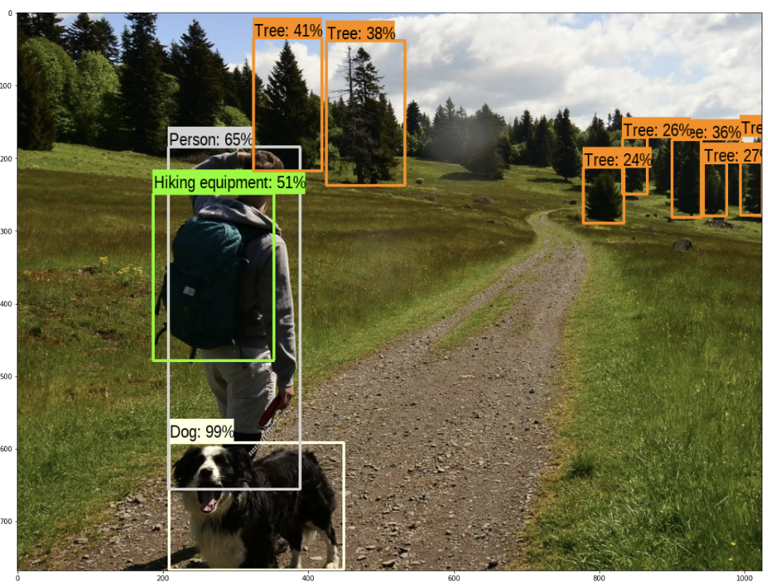
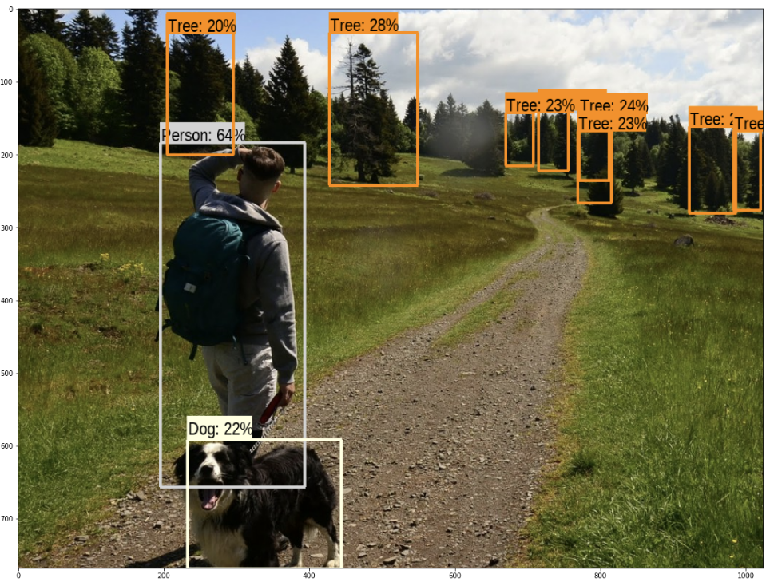

# Tensorflow 2.x Object Detection

Hardware:
- CPU: AMD® Ryzen 7 2700 eight-core processor × 16 
- Memory: 16G
- GPU: NVIDIA Corporation TU106 [GeForce RTX 2070]
- OS: Ubuntu 20.04.1 LTS

## Pre-trained RCNN + InceptionResNet V2
- Source: https://tfhub.dev/google/faster_rcnn/openimages_v4/inception_resnet_v2/1
- Inference time: **33.6s**

Result:

## Pre-trained fast SSD + MobileNet V2
- Source: https://tfhub.dev/google/openimages_v4/ssd/mobilenet_v2/1
- Inference time: **8.5s**

Result:
